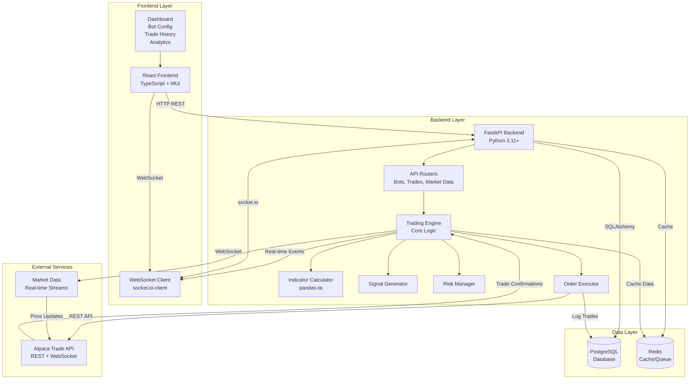
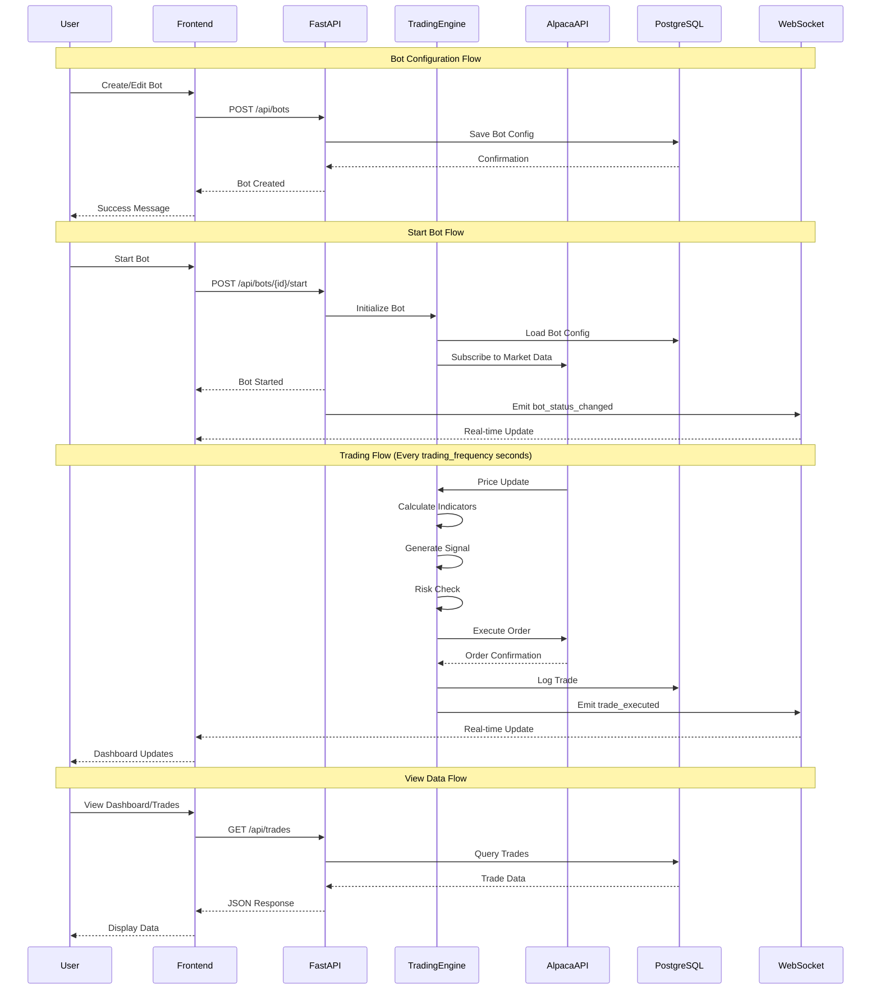
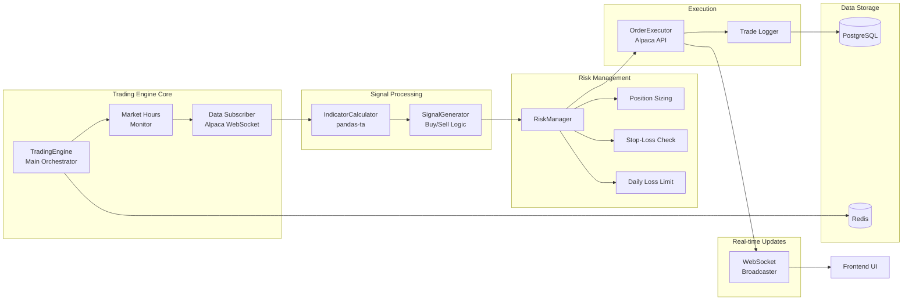
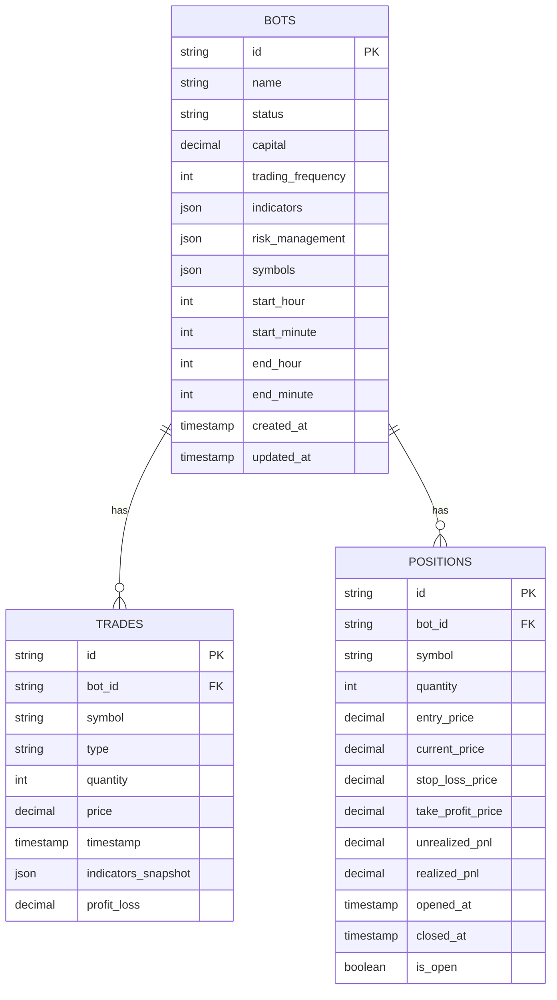
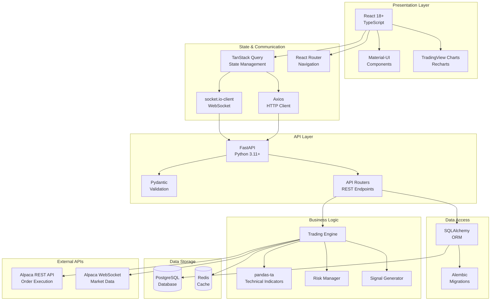
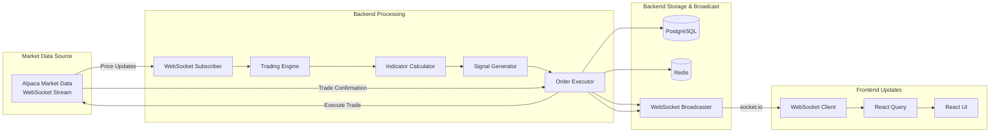
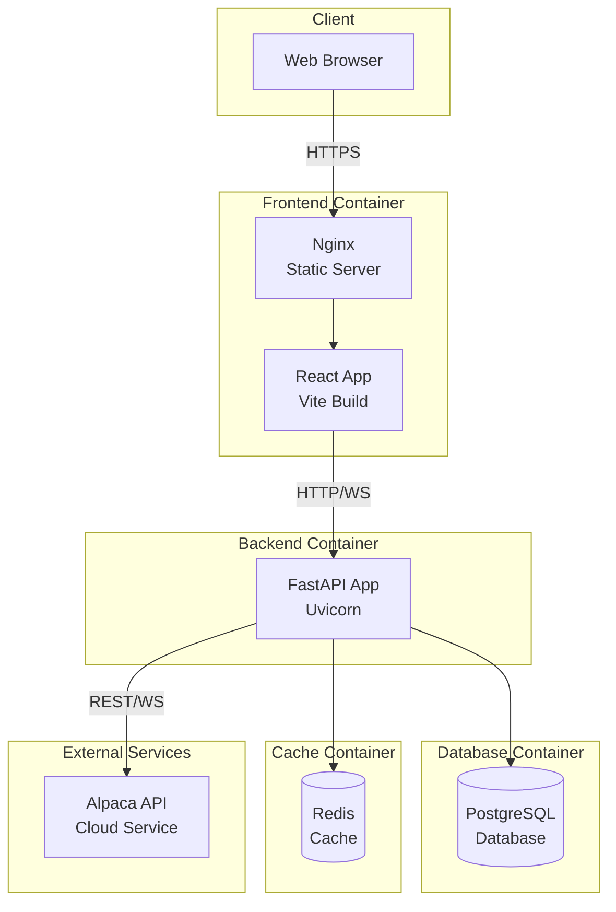
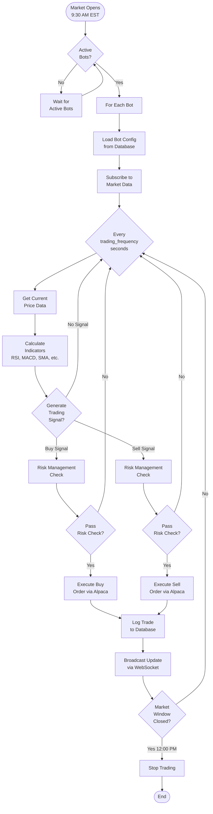

# Trading Bot System Architecture - Visual Diagrams

This document provides visual representations of how all system components relate to each other according to the architecture design.

---

## 1. High-Level System Architecture



---

## 2. Component Interaction Flow



---

## 3. Trading Engine Internal Architecture



---

## 4. Data Flow Diagram

```mermaid
flowchart TD
    subgraph "User Actions"
        Create[Create Bot]
        Start[Start Bot]
        View[View Dashboard]
    end

    subgraph "Frontend (React)"
        UI[React Components]
        Query[TanStack Query]
        WS[WebSocket Client]
    end

    subgraph "Backend API (FastAPI)"
        BotRouter[/api/bots]
        TradeRouter[/api/trades]
        MarketRouter[/api/market-data]
        WSEndpoint[/ws]
    end

    subgraph "Trading Engine"
        Engine[Trading Engine]
        Indicators[Calculate Indicators]
        Signals[Generate Signals]
        RiskCheck[Risk Management]
    end

    subgraph "External"
        AlpacaREST[Alpaca REST API]
        AlpacaWS[Alpaca WebSocket]
    end

    subgraph "Storage"
        Postgres[(PostgreSQL)]
        RedisCache[(Redis)]
    end

    Create --> UI
    Start --> UI
    View --> UI
    
    UI --> Query
    UI --> WS
    
    Query -->|HTTP| BotRouter
    Query -->|HTTP| TradeRouter
    Query -->|HTTP| MarketRouter
    
    WS -->|socket.io| WSEndpoint
    
    BotRouter --> Postgres
    TradeRouter --> Postgres
    MarketRouter --> RedisCache
    
    BotRouter -->|Start Command| Engine
    Engine -->|Subscribe| AlpacaWS
    AlpacaWS -->|Price Data| Engine
    Engine --> Indicators
    Indicators --> Signals
    Signals --> RiskCheck
    RiskCheck -->|Execute| AlpacaREST
    AlpacaREST -->|Confirmation| Engine
    Engine -->|Log| Postgres
    Engine -->|Cache| RedisCache
    Engine -->|Broadcast| WSEndpoint
    WSEndpoint -->|Real-time| WS
    WS -->|Update| UI
```

---

## 5. Database Schema Relationships



---

## 6. Technology Stack Layers



---

## 7. Real-time Data Flow



---

## 8. Deployment Architecture



---

## 9. Trading Logic Flow (Detailed)



---

## 10. Component Communication Matrix

| Component | Communicates With | Protocol | Purpose |
|-----------|-------------------|----------|---------|
| **React Frontend** | FastAPI Backend | HTTP REST | CRUD operations, data fetching |
| **React Frontend** | FastAPI Backend | WebSocket (socket.io) | Real-time updates |
| **FastAPI Backend** | PostgreSQL | SQL (via SQLAlchemy) | Data persistence |
| **FastAPI Backend** | Redis | Redis Protocol | Caching, pub/sub |
| **Trading Engine** | Alpaca API | REST API | Order execution |
| **Trading Engine** | Alpaca API | WebSocket | Market data subscription |
| **Trading Engine** | PostgreSQL | SQL (via SQLAlchemy) | Trade logging |
| **Trading Engine** | WebSocket Broadcaster | Internal | Real-time event emission |
| **Indicator Calculator** | Trading Engine | Internal (Python) | Indicator computation |
| **Risk Manager** | Trading Engine | Internal (Python) | Risk validation |
| **Signal Generator** | Trading Engine | Internal (Python) | Signal generation |

---

## 11. Key Data Flows

### Bot Creation Flow
```
User → Frontend Form → POST /api/bots → FastAPI → PostgreSQL → Response → Frontend → Success
```

### Trading Flow
```
Alpaca WebSocket → Trading Engine → Calculate Indicators → Generate Signal → 
Risk Check → Execute Order → Alpaca REST → Log to DB → Broadcast WebSocket → 
Frontend Update
```

### Dashboard Update Flow
```
User Opens Dashboard → Frontend → GET /api/summary → FastAPI → PostgreSQL → 
Response → Frontend Display
+
WebSocket Connection → Real-time Events → Frontend Auto-Update
```

### Position Monitoring Flow
```
Trading Engine → Position Opened → Log to DB → Broadcast WebSocket → 
Frontend Positions Page → Real-time Price Updates → Calculate Unrealized P&L → 
Display in UI
```

---

## Legend

- **Solid Lines**: Direct communication/data flow
- **Dashed Lines**: Optional or conditional flow
- **Arrows**: Direction of data/request flow
- **Boxes**: Components/services
- **Cylinders**: Data storage
- **Diamonds**: Decision points

---

## Notes

- All WebSocket connections use **socket.io** protocol
- Database operations use **SQLAlchemy ORM** with connection pooling
- Redis is **optional** but recommended for production
- All external API calls to Alpaca use **HTTPS**
- Frontend uses **TanStack Query** for automatic caching and refetching
- Trading Engine runs **asynchronously** and can handle multiple bots concurrently
