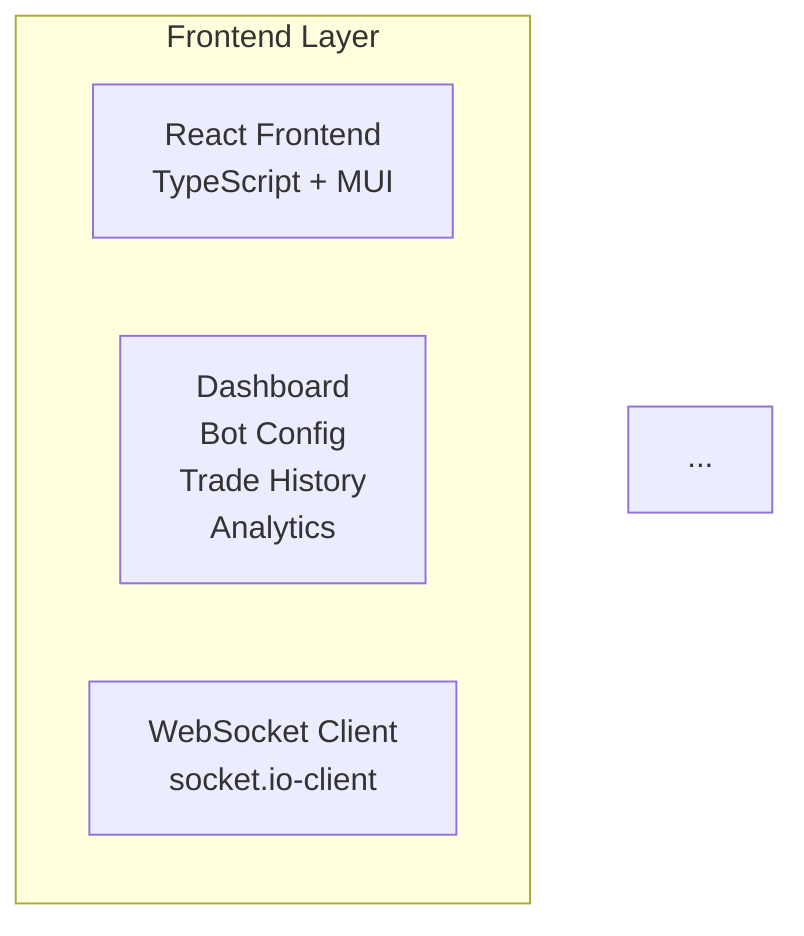
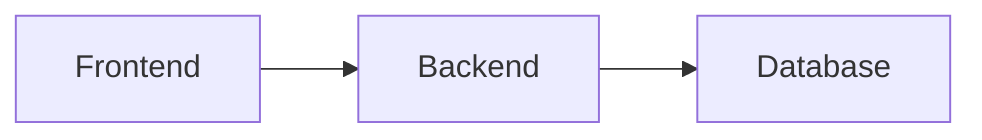

# How to View the Architecture Diagrams

The diagrams in `SYSTEM_ARCHITECTURE_DIAGRAMS.md` use **Mermaid** syntax. Here are several ways to view them:

## Option 1: VS Code with Mermaid Extension (Recommended)

1. **Install the Mermaid Preview extension**:
   - Open VS Code
   - Go to Extensions (Ctrl+Shift+X)
   - Search for "Markdown Preview Mermaid Support" by `bierner`
   - Install it

2. **View the diagrams**:
   - Open `SYSTEM_ARCHITECTURE_DIAGRAMS.md`
   - Press `Ctrl+Shift+V` (or `Cmd+Shift+V` on Mac) to open Markdown Preview
   - The Mermaid diagrams will render automatically

## Option 2: Online Mermaid Editor (Easiest)

1. Go to: **https://mermaid.live** or **https://mermaid.ink**
2. Copy the Mermaid code from any diagram (the code between ` ```mermaid ` and ` ``` `)
3. Paste it into the online editor
4. The diagram will render instantly

**Example**: Copy this code from the first diagram:


## Option 3: GitHub/GitLab

If you push the repository to GitHub or GitLab, the Mermaid diagrams will automatically render when viewing the `.md` file in the web interface.

## Option 4: VS Code Markdown Preview Enhanced

1. Install "Markdown Preview Enhanced" extension
2. Right-click on the `.md` file → "Markdown Preview Enhanced: Open Preview"
3. Diagrams will render automatically

## Option 5: Use the HTML Preview File

I've created an `ARCHITECTURE_DIAGRAMS.html` file that you can open directly in any web browser - no extensions needed!

---

## Quick Test

Try copying this simple diagram to https://mermaid.live to verify it works:



If this renders, you're all set!
